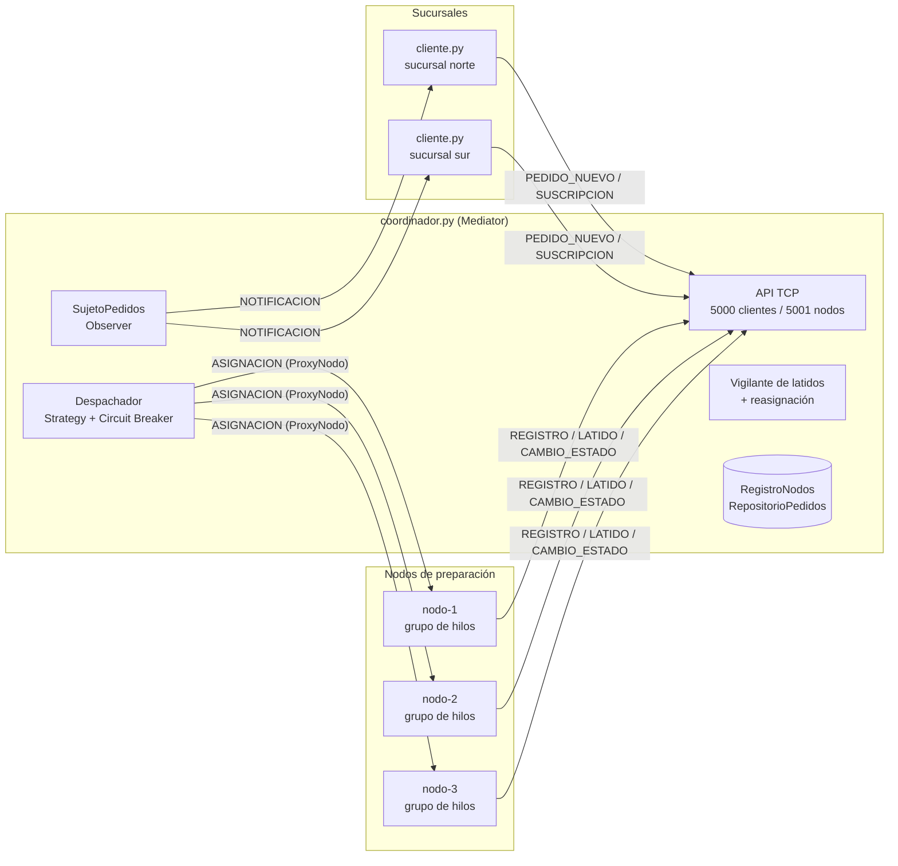
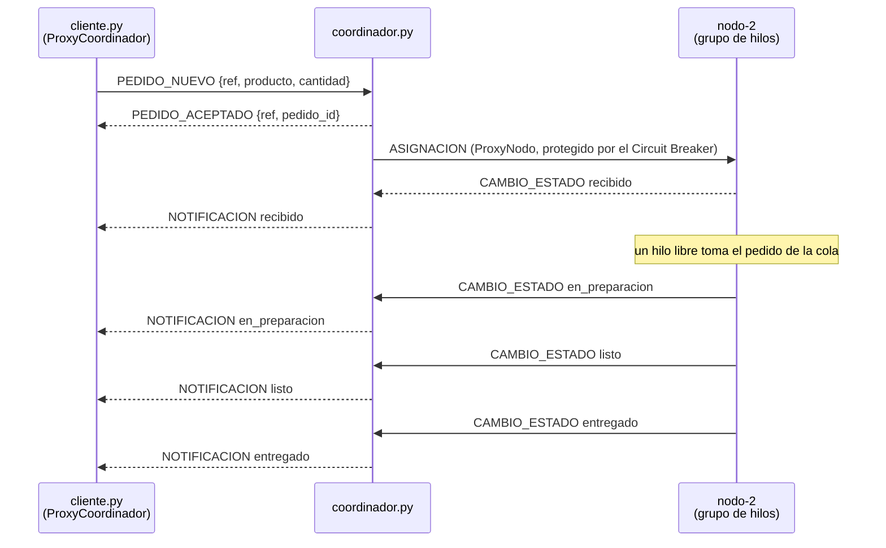

# CaféExpress Distribuido

Prototipo de una red de sucursales de café en la que los pedidos entran por un **nodo coordinador** y se reparten entre varios **nodos de preparación**, cada uno con su propio **grupo de hilos**. Los componentes son procesos independientes que se comunican por **sockets TCP** con mensajes **JSON**, se descubren al registrarse, se vigilan con **latidos** y avisan en tiempo real los cambios de estado de cada pedido a las sucursales suscritas.

Proyecto de la Unidad 2 del curso Arquitectura de Software: *Tejiendo redes: arquitectura de software entre hilos y nodos*.

Autor: **Yonathan López Blanco**. El usuario de GitHub `jotamedina14` es mi cuenta personal; los commits aparecen como *Yonathan Blanco*.

- Python 3.9 o superior, **solo biblioteca estándar** (`socket`, `threading`, `json`, `queue`, `logging`, `argparse`). No hay nada que instalar.
- Probado en Linux con Python 3.12. `demo.py` funciona también en Windows y macOS.

## Arquitectura



| Componente | Responsabilidad |
|---|---|
| `cliente.py` | Consola de una sucursal. Envía pedidos y recibe sus cambios de estado. No sabe qué nodo lo atiende. |
| `coordinador.py` | Único punto de coordinación. Registra nodos, vigila latidos, decide a qué nodo va cada pedido, reasigna los pedidos de nodos caídos y reenvía las notificaciones. |
| `nodo.py` | Recibe pedidos, los encola y los prepara con un grupo de hilos de tamaño configurable. Reporta cada transición de estado. |
| `protocolo.py` | Contrato compartido: los 10 tipos de mensaje y su serialización. Cliente y nodo no se conocen entre sí; solo conocen este archivo. |
| `dominio.py` | Menú, estados del pedido y sus reglas. No sabe nada de red ni de hilos. |

El coordinador está organizado por capas, cada una con una sola responsabilidad:

| Capa | Clases | Qué hace |
|---|---|---|
| API | `ServidorTCP`, `_atender_cliente`, `_atender_nodo` | Acepta conexiones (un hilo por conexión) y traduce mensajes en operaciones |
| Servicio | `Despachador`, `nodo_caido`, `_vigilar` | Balanceo, circuit breaker, detección de caídas y reasignación |
| Repositorio | `RegistroNodos`, `RepositorioPedidos` | Estado en memoria, con operaciones atómicas seguras entre hilos |
| Dominio | `dominio.Pedido` | Reglas del ciclo de vida de un pedido |

### Ciclo de un pedido



## Patrones de diseño

| Patrón | Dónde | Problema que resuelve |
|---|---|---|
| **Proxy remoto** | `patrones/proxy.py`: `ProxyCoordinador`, `ProxyNodo` | El cliente llama `hacer_pedido()` como si fuera local; el proxy oculta el socket, la serialización, la correlación de respuestas, los reintentos idempotentes y la reconexión automática con re-suscripción. El coordinador llama `asignar()` sobre cada nodo del mismo modo. |
| **Mediator** | `coordinador.py`: `Coordinador` | Evita la malla de todos contra todos entre sucursales y nodos: cada componente habla solo con el mediador. Agregar un nodo no obliga a tocar a los clientes. |
| **Observer distribuido** | `patrones/observer.py`: `SujetoPedidos`, `ObservadorRemoto` | El cliente se suscribe y recibe cada cambio de estado sin preguntar en bucle. Cada observador remoto tiene su propia cola y hilo escritor, así un cliente lento no frena a quien notifica. |
| **Strategy** | `patrones/balanceo.py`: `RoundRobin`, `MenorCarga` | La política de balanceo se elige con `--estrategia` sin tocar el despachador, lo que permite medir ambas y compararlas. |
| **Circuit Breaker** | `patrones/breaker.py`: `CircuitBreaker` | Tras 3 fallos seguidos hacia un nodo, deja de asignarle trabajo; a los 10 s permite una llamada de prueba. Evita que un nodo colgado frene al despachador con un timeout por pedido. |

## Protocolo

JSON, un mensaje por línea, sobre TCP. Definido en `protocolo.py`.

| Mensaje | Sentido | Contenido principal |
|---|---|---|
| `REGISTRO` | nodo → coordinador | `nodo_id`, `puerto`, `hilos`, `instancia` |
| `REGISTRO_OK` | coordinador → nodo | `intervalo_latido` |
| `LATIDO` | nodo → coordinador | cada 2 s: `en_cola`, `activos`, `procesados` |
| `PEDIDO_NUEVO` | cliente → coordinador | `ref`, `producto`, `cantidad`, `sucursal` |
| `PEDIDO_ACEPTADO` | coordinador → cliente | `ref`, `pedido_id` |
| `ASIGNACION` | coordinador → nodo | `pedido_id`, `producto`, `cantidad` |
| `CAMBIO_ESTADO` | nodo → coordinador | `pedido_id`, `estado` |
| `SUSCRIPCION` | cliente → coordinador | `pedido_id` (con `solo_consulta` para consultar sin suscribirse) |
| `NOTIFICACION` | coordinador → cliente | `pedido_id`, `estado`, `nodo_id`, `reasignado_desde` |
| `ERROR` | cualquiera | `codigo`, `motivo` |

Estados de un pedido: `recibido` → `en_preparacion` → `listo` → `entregado`. Un cambio solo se acepta si viene del nodo que tiene asignado el pedido y lo mueve hacia adelante: así se descartan los mensajes tardíos de un nodo al que ya se le quitó el pedido.

## Cómo ejecutarlo

### Demo rápida

```bash
./demo.sh                  # Linux o macOS: coordinador + 3 nodos + cliente automático
python demo.py             # cualquier sistema operativo, Windows incluido
python demo.py interactivo # igual, con el cliente interactivo
```

### Panel de demostración (una sola ventana, recomendado para la presentación)

```bash
python3 panel.py
```

Levanta el coordinador y los tres nodos como procesos independientes y muestra la salida de cada uno en su propio recuadro, junto con un cliente de sucursal integrado. Todo se maneja con teclas:

| Tecla | Acción |
|---|---|
| `i` | iniciar: el coordinador y luego los tres nodos, uno a uno |
| `p` | un pedido (capuchino x2) |
| `v` | diez pedidos al azar |
| `r` | ráfaga de treinta pedidos |
| `1` `2` `3` | tumbar ese nodo (equivale a Ctrl+C) o, si está caído, levantarlo de nuevo |
| `q` | salir y detener todo |

Los tiempos de preparación van triplicados para que se alcance a ver cada estado; `--factor-tiempo 1` usa los reales. Los eventos clave del coordinador (registros, caídas, circuito) quedan fijos arriba de su recuadro para que no se pierdan entre la traza.

### Paso a paso, una terminal por componente

```bash
python3 coordinador.py --estrategia menor_carga --nivel-log DEBUG   # terminal 1
python3 nodo.py --id nodo-1 --puerto 6001 --hilos 4                 # terminal 2
python3 nodo.py --id nodo-2 --puerto 6002 --hilos 4                 # terminal 3
python3 nodo.py --id nodo-3 --puerto 6003 --hilos 2                 # terminal 4
python3 cliente.py --sucursal norte                                 # terminal 5
```

En el cliente: `pedir latte 2`, `varios 10`, `consultar 3`, `seguir 3`, `menu`, `salir`. Para ver la tolerancia a fallos, cierra con Ctrl+C la terminal de un nodo mientras hay pedidos en curso: el coordinador lo detecta y reasigna sus pedidos, y el cliente lo ve en sus avisos.

### En varias máquinas de la misma red

```bash
python3 coordinador.py --host 0.0.0.0                                              # máquina A
python3 nodo.py --id nodo-1 --puerto 6001 --host 0.0.0.0 --coordinador <IP de A>   # máquina B
python3 cliente.py --coordinador <IP de A>                                         # máquina C
```

El coordinador se conecta a cada nodo usando la IP desde la que el nodo se registró, así que no hay que configurar direcciones a mano. Puede ser necesario permitir los puertos 5000, 5001 y 6001 en el firewall.

### Opciones principales

| Componente | Opción | Efecto |
|---|---|---|
| coordinador | `--estrategia round_robin \| menor_carga` | Política de balanceo (Strategy) |
| coordinador | `--sin-reasignacion` | Línea base sin tolerancia a caídas, para comparar |
| coordinador | `--timeout-latido`, `--umbral-fallos`, `--reintento-circuito`, `--timeout-asignacion` | Parámetros de detección de fallas |
| coordinador | `--nivel-log DEBUG` | Traza de cada pedido (reduce la capacidad del coordinador, ver resultados) |
| nodo | `--hilos N` | Tamaño del grupo de hilos |
| nodo | `--trabajo espera \| cpu` | Preparación como espera (E/S) o como cálculo puro |
| nodo | `--factor-tiempo F` | Escala los tiempos de preparación |
| nodo | `--calibracion N` | Iteraciones/s para `--trabajo cpu`; el mismo valor en todos los nodos garantiza el mismo cálculo por pedido |
| todos | `--logs DIR`, `--silencioso` | Carpeta de logs y logs solo a archivo |

Cada componente escribe su log en `logs/<componente>.log` con marca de tiempo en milisegundos y el nombre del hilo que escribió cada línea (`nodo-1-hilo-3`, `despachador`, `control-nodo-2`...).

## Pruebas

```bash
python3 -m unittest discover -s tests -v    # 65 pruebas unitarias y de integración (~12 s)
python3 pruebas/carga.py --pedidos 120 --clientes 6          # contra un sistema ya levantado
python3 pruebas/robustez.py                                  # levanta su propio sistema (~2 min)
python3 pruebas/experimentos.py                              # levanta su propio sistema (~4 min)
```

| Script | Qué hace | Salida |
|---|---|---|
| `tests/` | Protocolo, dominio, cada patrón por separado, el nodo contra un coordinador falso y el sistema completo en memoria: flujo, caída de nodo, nodo colgado aislado por el breaker, detección por latido | consola |
| `pruebas/carga.py` | N pedidos desde C sucursales a la vez (ráfaga o `--tasa` fija). Mide latencia promedio, p50, p95, máxima, throughput, pedidos perdidos, y separa la latencia en **espera en cola** y **preparación** para ubicar el cuello de botella | consola, `resultados/carga.csv`, `--detalle` por pedido |
| `pruebas/robustez.py` | Mata (`SIGKILL`) o congela (`SIGSTOP`) un nodo en plena carga y verifica que no se pierdan pedidos | `resultados/robustez.csv` y `.md` |
| `pruebas/experimentos.py` | Matriz completa: horizontal, vertical, balanceo, GIL, saturación y techo del coordinador | `resultados/experimentos.csv` y `.md` |

## Resultados de referencia

Medidos en un portátil Linux de 12 núcleos lógicos con Python 3.12; todos los componentes corren como procesos separados en la misma máquina y se hablan por TCP. En otra máquina los valores absolutos cambian, pero las proporciones deberían mantenerse. Las tablas completas las genera `pruebas/experimentos.py`.

**Escalabilidad horizontal frente a vertical** (120 pedidos en ráfaga, preparación como espera):

| Configuración | Throughput (ped/s) | Aceleración | Latencia prom. (s) |
|---|---|---|---|
| 1 nodo x 4 hilos | 5.36 | x1.00 | 11.10 |
| 2 nodos x 4 hilos | 10.46 | x1.95 | 5.68 |
| 3 nodos x 4 hilos | 14.22 | x2.65 | 3.91 |
| 1 nodo x 8 hilos | 10.65 | x1.99 | 5.69 |
| 1 nodo x 12 hilos | 15.28 | x2.85 | 3.97 |

Cuando el trabajo es de espera, agregar hilos a un nodo o agregar nodos rinde casi lo mismo: mientras un hilo espera, el intérprete de Python libera el GIL y los demás hilos avanzan, así que los hilos sí se solapan.

**Trabajo de CPU y el GIL** (30 pedidos de cálculo puro):

| Configuración | Throughput (ped/s) | Aceleración |
|---|---|---|
| 1 nodo x 1 hilo | 2.84 | x1.00 |
| 1 nodo x 3 hilos (vertical) | 2.76 | x0.97 |
| 3 nodos x 1 hilo (horizontal) | 7.16 | x2.52 |

Aquí está la diferencia de fondo: con cálculo puro, el hilo que calcula nunca suelta el GIL mientras trabaja, así que más hilos en un mismo proceso **no aceleran nada**: se turnan, no se solapan. Más nodos sí, porque cada nodo es un proceso con su propio intérprete y su propio GIL. Los dos resultados no se contradicen: escalar en vertical con hilos sirve para trabajo de espera, y para trabajo de cálculo solo sirve escalar en horizontal (más procesos o más máquinas).

**Balanceo con nodos de distinta capacidad** (2, 4 y 4 hilos): `menor_carga` logra 12.16 ped/s y p95 de 8.7 s, frente a 8.47 ped/s y p95 de 12.1 s de `round_robin`, que satura al nodo de 2 hilos (+44 % de throughput).

**Saturación:** un nodo de 4 hilos se estanca en ~5.5 ped/s. A 16 ped/s su latencia promedio sube a 6.1 s, casi toda en espera en cola. Con 3 nodos, la latencia se mantiene en ~0.7 s hasta 16 ped/s.

**Techo del coordinador** (preparación de ~1 ms, 2000 pedidos): unos 2200 ped/s con 1, 2 o 3 nodos. Agregar nodos no lo mueve, porque el límite es el coordinador. Escribir en el log tres líneas por pedido lo bajaba a 1500 ped/s; pasar esas trazas a nivel DEBUG fue el ajuste que lo subió en torno a un 47 %.

**Robustez** (120 pedidos a 10 ped/s, 3 nodos x 4 hilos, falla de `nodo-2` a los 4 s):

| Escenario | Perdidos | Detección | Circuito abierto | Latencia prom. / máx. (s) |
|---|---|---|---|---|
| SIGKILL, con reasignación | **0** | 0.002 s | - | 0.78 / 1.6 |
| SIGKILL, sin reasignación (línea base) | **2** | 0.002 s | - | 0.74 / 1.2 |
| SIGSTOP, timeout de asignación 1 s | **0** | 6.4 s (latido) | 3.0 s | 2.05 / 9.7 |
| SIGSTOP, timeout de asignación 0.25 s (ajuste) | **0** | 6.4 s (latido) | 0.76 s | 0.88 / 8.0 |

Una caída abrupta se detecta al instante porque el sistema operativo cierra la conexión. Un nodo congelado no cierra nada: el Circuit Breaker lo aísla antes de que venza el latido. Con un timeout de asignación más corto, el despachador queda bloqueado menos tiempo y la latencia promedio baja de 2.05 s a 0.88 s. La latencia máxima la marca el latido (6 s), que es lo que tardan en rescatarse los pedidos atrapados en el nodo congelado.

## Decisiones de diseño y limitaciones conocidas

- **El coordinador es un punto único de falla.** Es el costo del Mediator: si cae, las sucursales no pueden pedir (los proxies se reconectan solos cuando vuelve, pero los pedidos en memoria se pierden). La mejora natural es replicarlo con un líder y un seguidor que compartan el estado.
- **Estado en memoria.** Pedidos y nodos viven en el proceso del coordinador. Persistirlos (SQLite, un log de eventos) permitiría recuperar pedidos tras un reinicio.
- **Un hilo por conexión.** Es simple y deja ver los hilos, pero no escala a miles de sucursales conectadas. Con `selectors` o `asyncio` se atenderían muchas conexiones con pocos hilos.
- **Un solo hilo despachador.** Mantiene el orden de llegada sin bloqueos complejos, pero cada timeout contra un nodo colgado lo frena entero. El circuit breaker y un timeout de asignación corto (0.25 s) acotan el efecto; despachar en paralelo por nodo lo eliminaría.
- **Los tiempos de preparación son simulados.** En modo `espera` el nodo espera como un barista; en modo `cpu` hace una cantidad fija de cálculo, calibrada al arrancar.
- **Idempotencia y orden.** Los pedidos llevan un `ref` generado por el cliente, así que un reintento nunca crea un pedido duplicado. Los nodos ignoran asignaciones repetidas. Si un estado llega antes que el anterior (viajan por conexiones distintas), el coordinador completa los intermedios y el cliente recibe siempre el ciclo completo y en orden.

## Estructura

```
cafe-express-distribuido/
├── protocolo.py          contrato de mensajes
├── dominio.py            menú, estados y reglas del pedido
├── bitacora.py           logs por componente con milisegundos e hilo
├── coordinador.py        Mediator: API, despachador, latidos, repositorios
├── nodo.py               nodo de preparación con grupo de hilos
├── cliente.py            consola de sucursal
├── patrones/
│   ├── proxy.py          Proxy remoto
│   ├── observer.py       Observer distribuido
│   ├── balanceo.py       Strategy
│   └── breaker.py        Circuit Breaker
├── pruebas/
│   ├── entorno.py        levanta el sistema como procesos reales
│   ├── carga.py          prueba de carga y métricas
│   ├── robustez.py       caída y congelamiento de nodos
│   └── experimentos.py   matriz de escalabilidad
├── tests/                pruebas unitarias y de integración
├── panel.py              demostración en una sola ventana
├── demo.sh, demo.py      demostración con procesos en segundo plano
└── resultados/           CSV y tablas de las corridas documentadas en este README
```
